# Midipaaa
Midipaaa Family Project

The project consisted of the development of a web system for the organization “Familia Midipaaa”. The web system automates and controls the processes of the “Familia Midipaaa” organization, through the use of technological tools that are based on Free Software. The web system was developed from scratch. The system has several modules:

* Module for registering users of the web system who are the administrative staff of the organization.
* Module for registering the data of the beneficiaries and registering their necessary data as family burden
* Module for registering the different types of charity aid food box models.
* Module control for the list of activities carried out and to be carried out.
* Module reporting to: display the information of the beneficiaries and their family data.
* Display the information as the total number of benefited families.
* Display the information on the total number of sectors where the distribution is made.
* View the information on the list of food box models.
* View the information on the total number of food boxes to be distributed.
* Display a page where the organization's information is displayed and a page with contact information.

This system was developed with Python-Django, PorstgreSQL was used for data persistence

# Screenshots
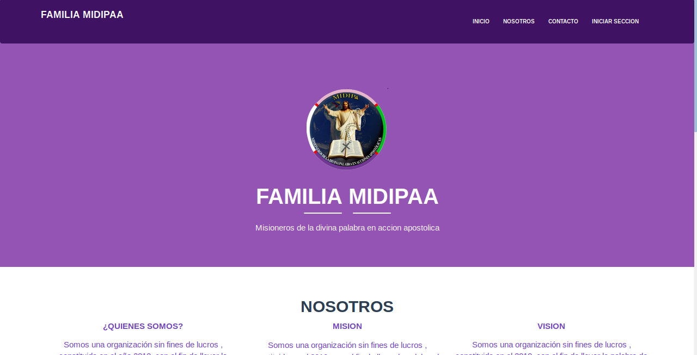
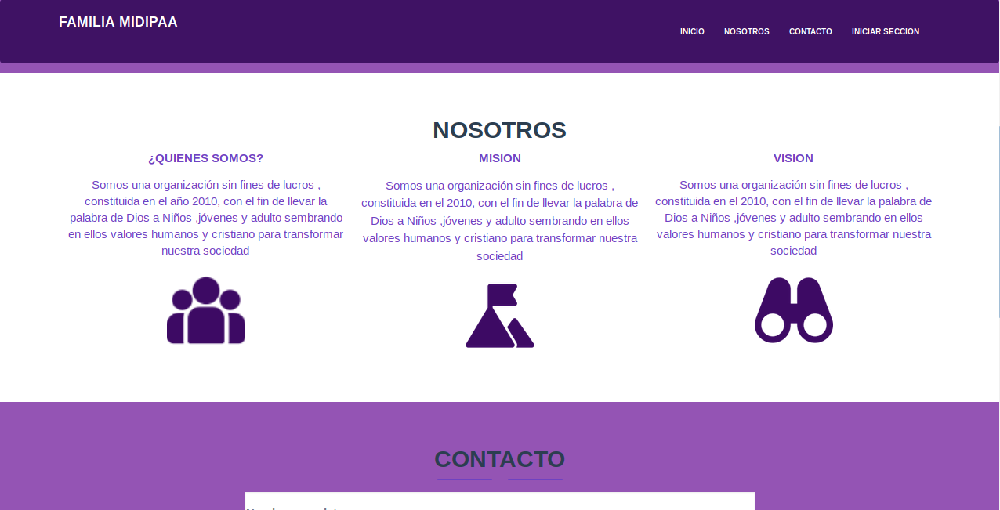
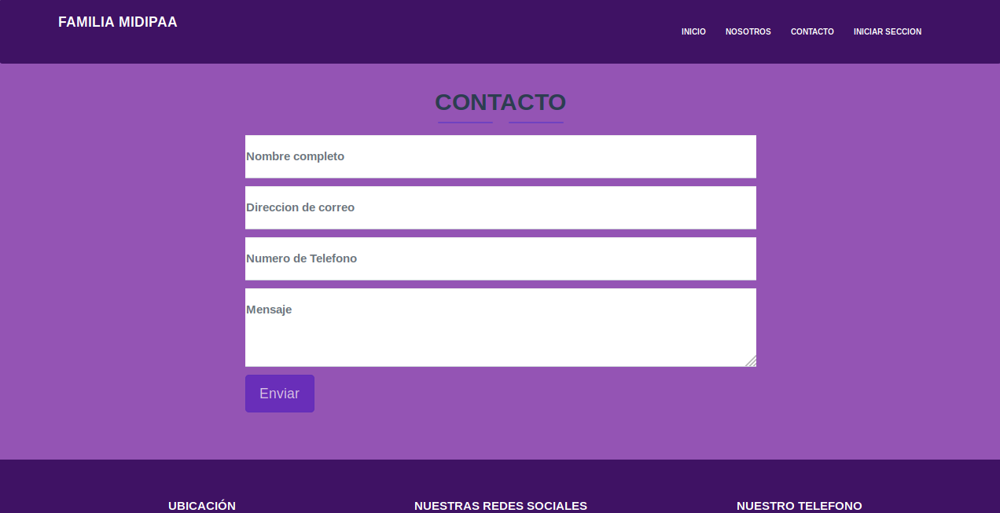
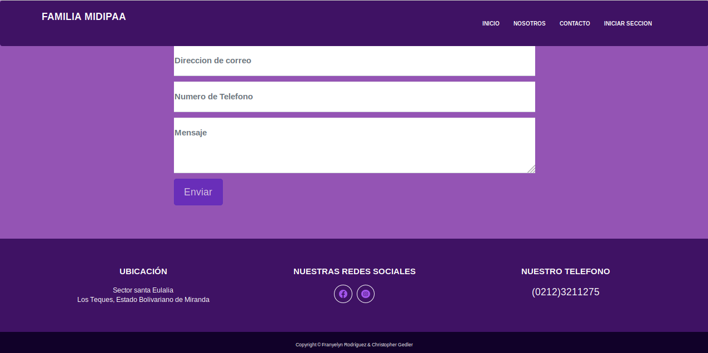
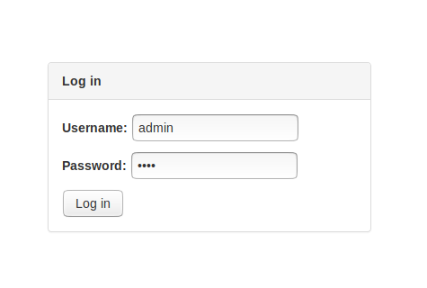
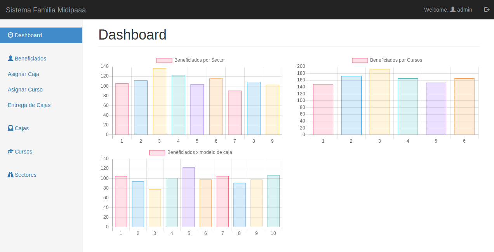
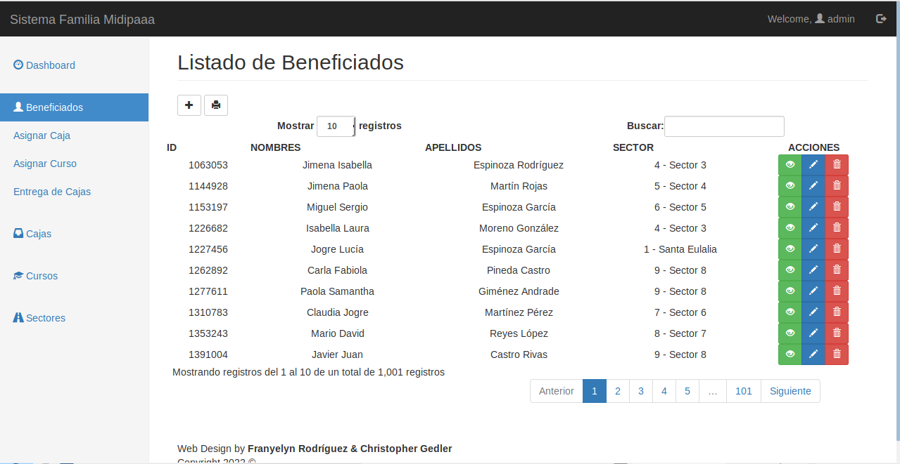
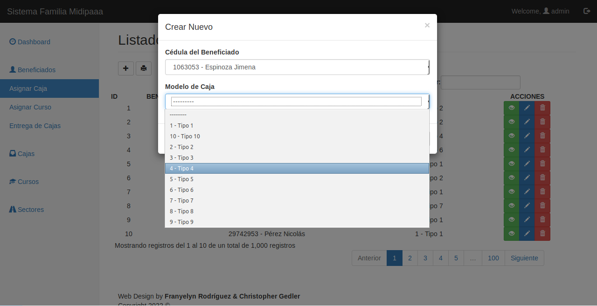
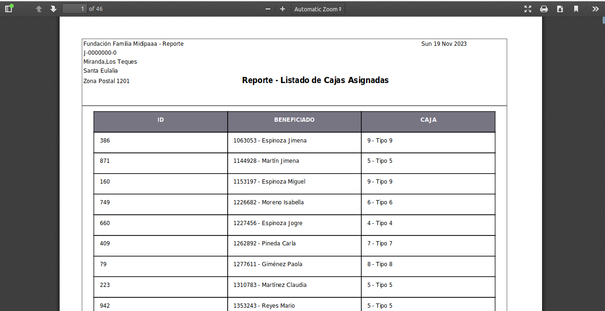
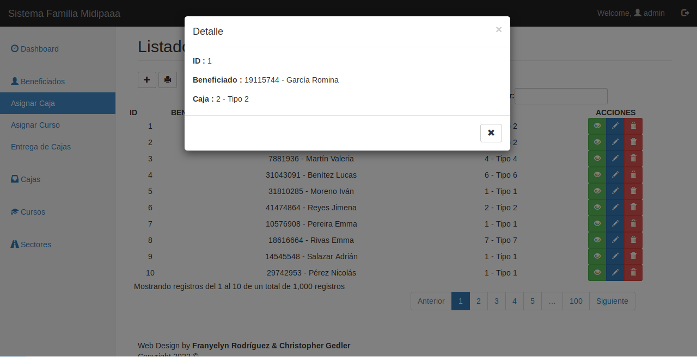
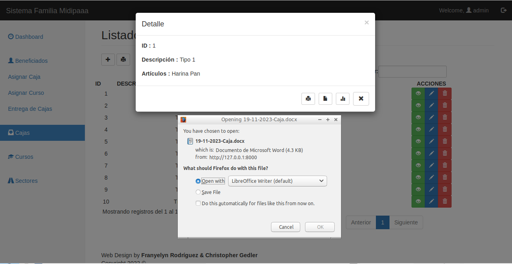
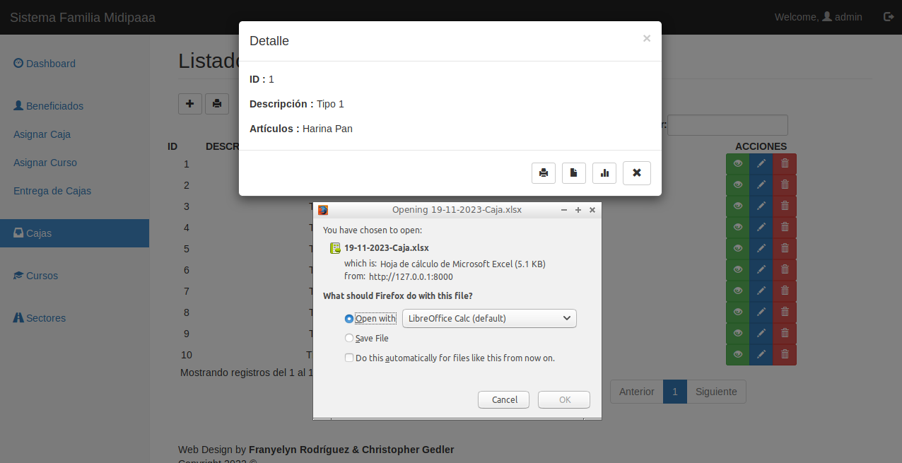
